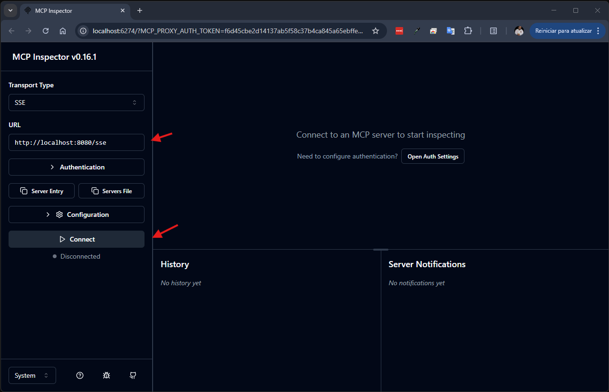
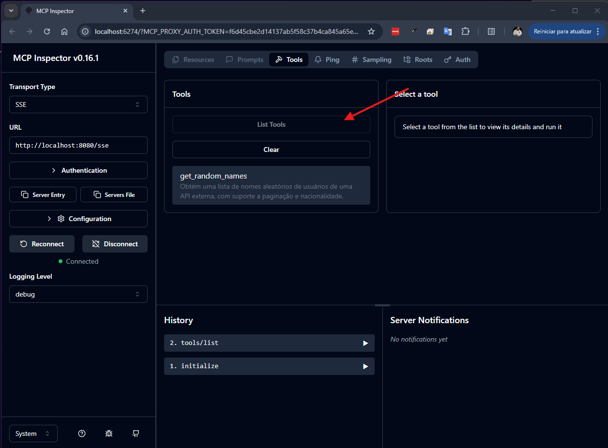

# 🚀 Random User MCP Server

This project was created with the assistance of Junie. For additional context and development guidelines, please refer to the `.junie/guidelines.md` file.

## 📖 Overview

### 🎯 Project Purpose

This project implements a Model Context Protocol (MCP) server using **Kotlin** and the **Ktor** framework, designed to provide random user data. It serves as an example of how to integrate external APIs (specifically `randomuser.me`) with the MCP framework, exposing functionalities as tools that can be consumed by AI agents and other MCP-compatible clients.

### 🛠️ Model Context Protocol (MCP) Details

This project leverages the Model Context Protocol (MCP) to enable AI agents and other clients to interact with its functionalities. For more information on MCP, refer to the official documentation:

- **MCP Official Website**: [https://modelcontextprotocol.io/](https://modelcontextprotocol.io/)
- **Kotlin SDK for MCP**: [https://github.com/modelcontextprotocol/kotlin-sdk](https://github.com/modelcontextprotocol/kotlin-sdk)

## 🚀 Getting Started

### 🏗️ Building the MCP Server

To generate the executable JAR file for the MCP server, which includes all necessary dependencies (a "fat jar"), run the following command in the project root:

```bash
./gradlew build
```

This command will compile the code and create the `build/libs/random-user-mcp-all.jar` file.

### 🏃 Running the MCP Server

This server can be run in two different modes, depending on the communication method you want to use:

1.  **`stdio` (Standard Input/Output)**: This is the default mode. It's ideal for local integrations where a client application (like Claude Desktop) runs the server as a subprocess and communicates with it directly through standard input and output streams. To run in this mode, execute the JAR without arguments or with the `stdio` argument:
    ```bash
    java -jar build/libs/random-user-mcp-all.jar stdio
    ```

2.  **`sse` (Server-Sent Events)**: This mode runs the server as a web server, allowing it to be accessed over the network. It uses HTTP for communication, with the server sending events to the client. This is ideal for remote access or when you need to serve multiple clients. To run in this mode, use the `sse` argument:
    ```bash
    java -jar build/libs/random-user-mcp-all.jar sse
    ```

## 🧪 Testing and Integration

### 🤖 Testing in Claude Desktop

To use `random-user-mcp` with Claude Desktop, you need to configure Claude's configuration file. This file is usually called `claude_desktop_config.json` and its location varies depending on the operating system:

*   **macOS**: `~/Library/Application Support/Claude/claude_desktop_config.json`
*   **Windows**: `%APPDATA%\Claude\claude_desktop_config.json`

You can access this file by opening Claude Desktop, going to "Settings...", then "Developer", and clicking on "Edit Config".

Add the following configuration to the `mcpServers` section of your `claude_desktop_config.json` file:

```json
{
  "mcpServers": {
    "server-names": {
      "command": "java",
      "args": [
        "-jar",
        "[PROJECT_PATH]/random-user-mcp/build/libs/random-user-mcp-all.jar"
      ]
    }
  }
}
```

*   **[PROJECT_PATH]**: Replace this placeholder with the absolute path where the `random-user-mcp` project is located on your machine (e.g., `C:\projects\random-user-mcp` on Windows, or `/home/your_user/projects/random-user-mcp` on Linux/macOS).

After saving the changes to the `claude_desktop_config.json` file, **restart Claude Desktop** for the new configuration to be loaded and the `random-user-mcp` server to be started.

---

### 🔍 Testing with MCP Inspector

**Important:** Before proceeding, ensure your `random-user-mcp` server is running in `sse` (Server-Sent Events) mode in a separate terminal. You can start it using the command:

```bash
java -jar build/libs/random-user-mcp-all.jar sse
```

The MCP Inspector is a powerful tool for visualizing and interacting with your MCP server's capabilities. It provides a user-friendly interface to explore registered tools and test their functionality.

For detailed information, refer to the official documentation: [https://modelcontextprotocol.io/docs/tools/inspector](https://modelcontextprotocol.io/docs/tools/inspector).

Follow these steps to test your `random-user-mcp` server using the Inspector:

1.  **Launch the Inspector:**
    Open your terminal and run the following command. This will start the Inspector application and automatically open it in your default web browser.

    ```bash
    npx @modelcontextprotocol/inspector
    ```

2.  **Connect to your MCP Server:**
    Once the Inspector opens in your browser, you'll see an interface to connect to an MCP server.
    - In the "URL" field, enter the URL where your `random-user-mcp` server is running (e.g., `http://localhost:8080/sse`).
    - Click the "Connect" button.

    

3.  **List Available Tools:**
    After successfully connecting, the Inspector will display information about your server. To see the tools registered by your `random-user-mcp` server:
    - Click the "list tools" button.

    

4.  **Verify Tool Listing:**
    If the connection and tool registration are successful, you should now see a list of all tools provided by your `random-user-mcp` server, ready for interaction and testing.
